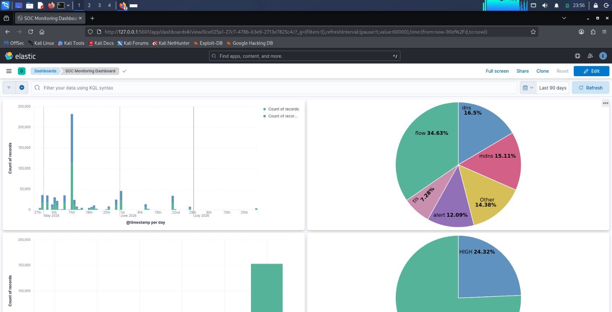
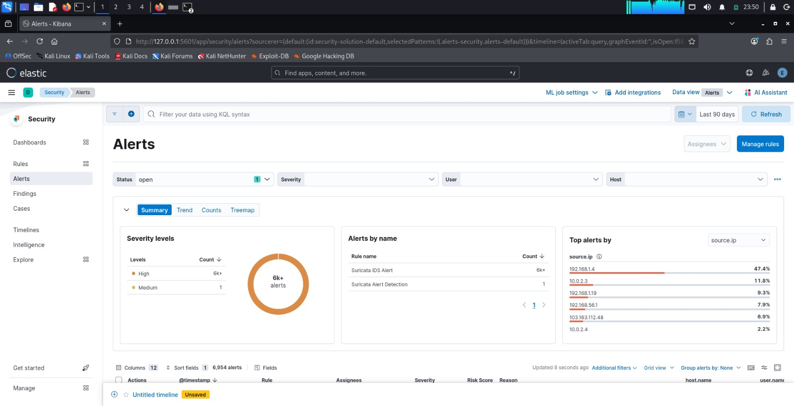
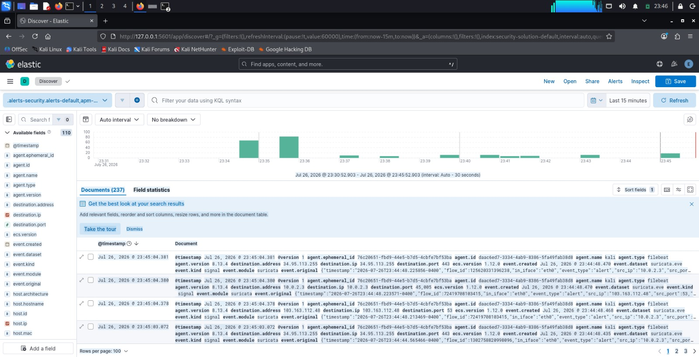
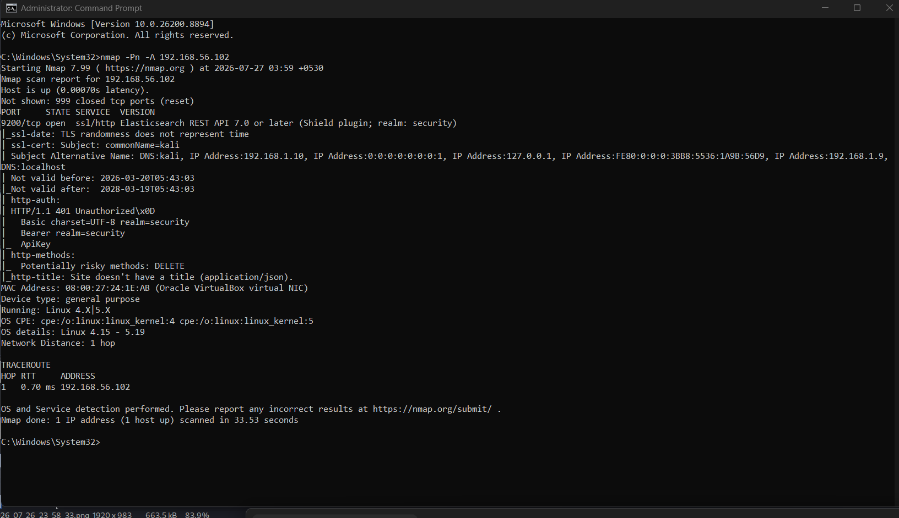
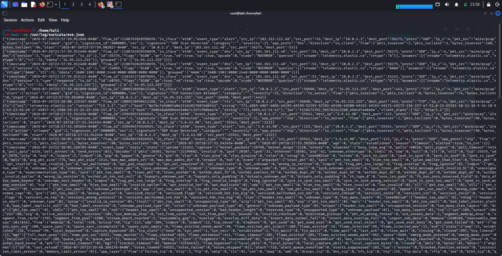

# 🛡️ ELK Stack Network Security Monitoring System

A Security Operations Center (SOC) Home Lab built on **Kali Linux** using the **ELK Stack (Elasticsearch, Logstash, Kibana)** and **Suricata IDS** for real-time network monitoring, threat detection, and threat intelligence enrichment.

---

## 📌 Project Overview

This project demonstrates a complete Network Security Monitoring (NSM) solution capable of:

- Detecting network attacks using Suricata IDS
- Collecting logs using Filebeat
- Processing logs with Logstash
- Storing data in Elasticsearch
- Visualizing alerts in Kibana
- Enriching alerts using VirusTotal API and AlienVault OTX

---

## 🛠️ Technologies Used

- Kali Linux
- Elasticsearch
- Logstash
- Kibana
- Filebeat
- Suricata IDS
- VirusTotal API
- AlienVault OTX
- Nmap

---

## 🏗️ Architecture

```
Windows Host (Nmap)
        │
        ▼
   Suricata IDS
        │
        ▼
     Filebeat
        │
        ▼
     Logstash
        │
        ▼
 Elasticsearch
        │
        ▼
      Kibana
```

---

## ⚔️ Attack Simulation

The following attacks were simulated:

- Nmap SYN Scan
- Service Version Scan
- OS Detection
- ICMP Ping Flood
- SSH Brute Force
- Malware Test
- DNS Anomaly Detection

---

## 🚀 Features

- Real-time Intrusion Detection
- Threat Intelligence Enrichment
- VirusTotal Integration
- AlienVault OTX Integration
- Kibana Dashboard
- Security Alert Detection
- Threat Level Classification
- Custom Suricata Rules

---

## 📷 Screenshots

### SOC Monitoring Dashboard



### Security Alerts



### Discover View



### Nmap Attack Simulation



### Suricata eve.json



---

## 🎯 Outcome

Successfully built a complete SOC Home Lab capable of detecting, analysing and visualising network threats using the ELK Stack and Suricata IDS with integrated threat intelligence.
